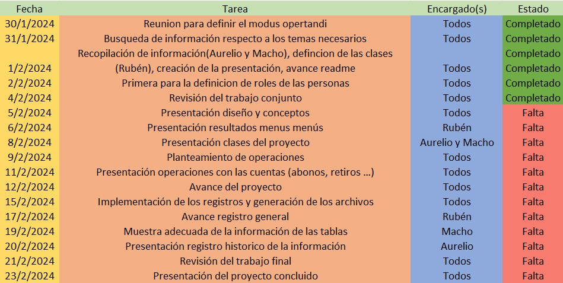

<!-- From MachoBranch -->

# ie0217-proyecto
# Función de Obtención de Certificados de Depósito a Plazo

## Propósito
- Esta parte del proyecto tiene como propósito llevar a cabo la función de obtener certificados de depósito a plazo como opción para los clientes.

## Descripción
- Los certificados de depósito a plazo representan un instrumento atractivo de inversión donde el cliente ahorrante deposita una cantidad determinada de dinero por un plazo previamente definido. Este plazo fijo permite al cliente obtener un rendimiento fijo desde la fecha de inicio del depósito. Considerado como un excelente instrumento de inversión, en los CDP (Certificados de Depósito a Plazo) el rendimiento esperado se acuerda en el momento de la expedición del certificado y permanece inalterado hasta su vencimiento. Además, cabe destacar que este tipo de certificado presenta un bajo riesgo para el inversor.

## Dudas Comunes

### Acceso al Dinero Antes de Tiempo
- Una de las principales dudas respecto a los CDP es la posibilidad de acceder al dinero antes de la fecha de vencimiento. En caso de que el cliente desee retirar el dinero antes de tiempo, debe estar preparado para enfrentar las consecuencias estipuladas por el banco, como puede ser una penalización por retiro anticipado.

### Tasas de Interés
- Otra duda frecuente se relaciona con las tasas de interés. La tasa de interés que el cliente puede esperar ganar varía en función del plazo del depósito y del monto depositado. Por lo general, los bancos ofrecen una variedad de plazos y tasas, permitiendo al cliente elegir la opción que mejor se ajuste a sus necesidades de inversión.

## Sección de informiación
- Para empezar, es necesario tener claro los tipos de préstamos que se van a trabajar a lo largo del proyecto, por lo cual se debe de dejar en claro cuales son los mismos y en qué consiste cada uno.  

- Los préstamos personales corresponden a los préstamos que se le adjuntan a un individuo sin la necesidad de especificar el uso de los fondos, generalmente están basados en su capacidad crediticia y su historial de finanzas, estos suelen tener plazos de amortización más cortos. Existen distintas modalidades, desde los simples hasta las líneas de crédito revolventes.  
- Los préstamos hipotecarios son de largo plazo que se utilizan para financiar la compra de una propiedad inmobiliaria. Estos préstamos están garantizados por la propiedad misma, que actúa como colateral para el préstamo. Generalmente los préstamos hipotecarios tienen plazos más largos que otros tipos de préstamos, que pueden variar desde 15 hasta 30 años, y las tasas de interés pueden ser fijas o variables. En caso de incumplimiento del pago del préstamo, el prestamista tiene el derecho de ejecutar la hipoteca y tomar posesión de la propiedad para recuperar la deuda.  
- Finalmente los préstamos prendarios, los cuales son garantizados por un bien tangible, como un automóvil, una motocicleta, una embarcación, maquinaria u otros activos similares. El bien actúa como garantía del préstamo y, en caso de incumplimiento del prestatario, el prestamista tiene el derecho de tomar posesión del bien para recuperar la deuda. Estos préstamos suelen tener tasas de interés más bajas que los préstamos personales no garantizados, ya que ofrecen una mayor seguridad para el prestamista.
- Entonces se puede ver que los créditos personales son a corto plazo y con un interés generalmente mayor que los préstamos prendarios e hipotecarios, en cambio los préstamos prendarios e hipotecarios son a largo plazo y utilizan el bien como garantía, en caso de incumplimiento del pago.  
- Bueno, entonces, la fórmula adecuada para calcular los datos del saldo y las cuotas disponibles de los préstamos, las fórmulas son las mismas, sin embargo, lo que cambia entre un préstamo y otro se trata de las tasas de interés y los plazos de pago o cuotas de los préstamos. La fórmula usada para calcular la cuota mensual de un crédito es la siguiente:  
  
- Esa es la fórmula utilizada para calcular las cuotas de cada crédito. Esta solamente es una aproximación y no toma otros factores en cuenta, pero para los usos de nuestro proyecto, servirá de buena manera.  
- Con esto en mente, es apropiado señalar que se van a crear ciertos prestamos predeterminados para que el usuario los analice y piense si son adecuados para su situación particular. Seguidamente se presentarán las propuestas de los prestamos, son 3 propuestas por tipo de préstamo.  
### Préstamo Personal:  
- Primera opción  
1.	Tasa de interés: 8%  
2.	Cuotas: 36  
- Segunda opción  
1.	Tasa de interés: 6.5%  
2.	Cuotas: 48  
- Tercera opción  
1.	Tasa de interés: 10%  
2.	Cuotas: 24  
### Préstamo Hipotecario:  
- Primera opción  
1.	Tasa de interés: 4,5%  
2.	Cuotas: 360 (a 30 años)  
- Segunda opción  
1.	Tasa de interés: 3.8%  
2.	Cuotas: 300 (a 25 años)  
- Tercera opción  
1.	Tasa de interés: 4%  
2.	Cuotas: 336 ( a 28 años)  
### Préstamos prendarios:  
- Primera opción  
1.	Tasa de interés: 6%  
2.	Cuotas: 24 (a 2 años)  
- Segunda opción  
1.	Tasa de interés: 5.2%  
2.	Cuotas: 36 (a 3 años)  
- Tercera opción  
1.	Tasa de interés: 4.5%  
2.	Cuotas: 48 ( a 4 años)  
- Estos son los prestamos presentados, los montos solicitados son variables.  

# Propuesta de agenda para la realización del proyecto.  
- A continuación se presentan la agenda propuesta para completar el proyecto, con fechas, objetivos, encargados y el estado de las tareas.  
  
- Sin embargo, esta agenda se encuentra sujeta a cambios, no es la final y puede sufrir de modifcaciones en la marcha.

# Definición de las clases  y métodos.
## Clase: Usuario
- Atributos
    - Nombre
    - Identificación
    - Cuenta en colones
    - Cuenta en dólares
    - Saldos
    - Préstamos asociados
- Métodos
    - Constructor
    - Depósito
    - Retiro
    - Solicitar préstamo
    - Crear Certificado de Deposito a Plazo.

## Clase: Préstamo
- Atributos
    - Tipo de préstamo
    - Tasa de interés
    - Monto
    - Periodo mensual
- Métodos
    - Constructor
    - Información de préstamo
    - Abonar
    - Generar reporte

## Clase: CDP
- Atributos
    - Tasa de interés 
    - Monto
    - Plazo
- Métodos
    - Constructor
    - Eliminar CDP

## Posible clase adicional
- Se tiene en consideración la creación de una posible clase extra, la cual se llamaria Clase Cuenta, esta funcionaría para almacenar la información de tipo (dólares o colones), saldos e implementar los métodos de depósito, retiro, transacción...

# Prototipo del menu

## Seleccione el modo

- Atención a clientes
    - Preguntar por el numero de cliente
        - Deposito
        - Retiro
        - Transferencia entre cuentas
        - Reporte sobre prestamos propios
        - Abono a prestamo
            - Prestamo propio
            - Prestamo de otro cliente

- Obtener información general sobre préstamos bancarios
    - Desplegar informacion predefinida y Generar una tabla de pagos esperados para la opción y monto elegidos por el usuario
    - Obtener la tabla mediante valores personalizados de monto, cantidad de cuotas y la tasa de interés.

